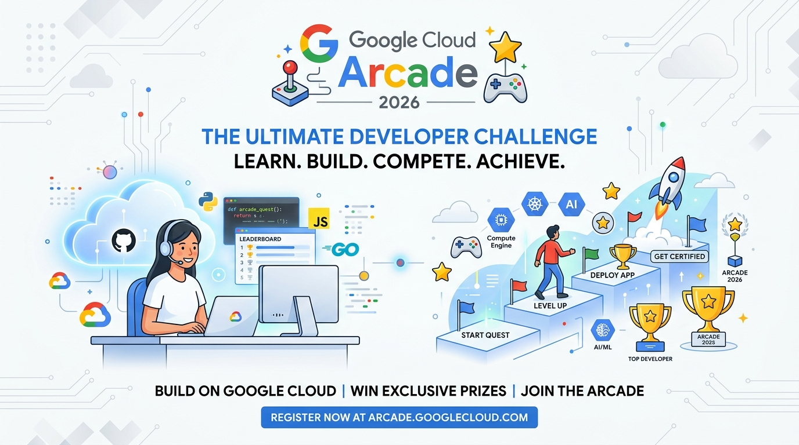

# 🎮 Google Cloud Arcade & Skills Fastrack 2026 Tracker

> **Powered by Hazz** • Lacak milestone dan selesaikan semua Google Cloud Qwiklabs dengan panduan terintegrasi.

## 🏆 Sistem Poin & Target Milestone

Poin dihitung menggunakan rumus resmi program Fasilitator:

- **1.0 Poin** untuk setiap **Arcade Game**.
- **0.5 Poin** untuk setiap **Skill Badge**.
- **Bonus Poin** diberikan untuk Milestone tertinggi yang dicapai (non-kumulatif).

| Milestone | Syarat Kelulusan | Poin Bonus | Total Poin (Base + Bonus) |
| :--- | :--- | :---: | :---: |
| 🏅 **Milestone 1** | 6 Games + 14 Skill Badges | `+5` | **18.0 Poin** |
| 🥈 **Milestone 2** | 8 Games + 28 Skill Badges | `+15` | **37.0 Poin** |
| 🥇 **Milestone 3** | 10 Games + 42 Skill Badges | `+25` | **56.0 Poin** |
| 👑 **Ultimate Milestone (M4)** | 12 Games + 56 Skill Badges | `+35` | **75.0 Poin** |

---

## 🕹️ 1. Arcade Games Track

Berikut adalah daftar game aktif. Gunakan **Kode Akses** untuk membukanya di portal Arcade.

| No | Judul Game | Kode Akses | Link Game |
| :---: | :--- | :---: | :---: |
| 1 | **Arcade Base Camp July 2026** | `1q-basecamp-07511` |  |
| 2 | **Arcade Adventure: Low-Code Development** | `1q-lowcode-07512` |  |
| 3 | **Arcade Simulator: Data Mesh Architect** | `1q-datamesh-07513` |  |
| 4 | **Arcade Trail: Google Workspace Administration** | `1q-workspace-07514` |  |
| 5 | **Arcade Voyage: Cloud Storage and Data Governance** | `1q-storage-07515` |  |
| 6 | **Safe Spaces** | `1q-safespaces-07516` |  |

### 📂 Daftar Lab di Dalam Game (Collapsible)
Klik pada judul game di bawah ini untuk melihat detail lab di dalamnya:

<b>🎮 1. Arcade Base Camp July 2026 (8 Labs) - Kode Akses: 1q-basecamp-07511</b>

| No | ID Lab | Nama Lab | Link Lab | Link YouTube |
| :---: | :---: | :--- | :---: | :---: |
| 1 | `GSP750` | Infrastructure as Code with Terraform |  | - |
| 2 | `GSP751` | Interact with Terraform Modules |  | - |
| 3 | `GSP752` | Manage Terraform State |  | - |
| 4 | `GSP345` | Build Infrastructure with Terraform on Google Cloud: Challenge Lab |  | - |
| 5 | `GSP1185` | Securing Container Builds |  | - |
| 6 | `GSP1184` | Secure Builds with Cloud Build |  | - |
| 7 | `GSP1183` | Gating Deployments with Binary Authorization |  | - |
| 8 | `GSP521` | Secure Software Delivery: Challenge Lab |  | - |

<b>🎮 2. Arcade Adventure: Low-Code Development (7 Labs) - Kode Akses: 1q-lowcode-07512</b>

| No | ID Lab | Nama Lab | Link Lab | Link YouTube |
| :---: | :---: | :--- | :---: | :---: |
| 1 | `GSP883` | Google AppSheet: Getting Started |  | - |
| 2 | `GSP910` | Connect and Configure Data for Your AppSheet App |  | - |
| 3 | `GSP1030` | Publish Your AppSheet App |  | - |
| 4 | `GSP081` | Cloud Run Functions: Qwik Start - Console |  | - |
| 5 | `GSP080` | Cloud Run Functions: Qwik Start - Command Line |  | - |
| 6 | `ARC105` | App Building with AppSheet: Challenge Lab |  | - |
| 7 | `ARC104` | Build Serverless Applications with Cloud Run Functions: Challenge Lab |  | - |

<b>🎮 3. Arcade Simulator: Data Mesh Architect (5 Labs) - Kode Akses: 1q-datamesh-07513</b>

| No | ID Lab | Nama Lab | Link Lab | Link YouTube |
| :---: | :---: | :--- | :---: | :---: |
| 1 | `GSP1145` | Build a Data Mesh with Knowledge Catalog |  | - |
| 2 | `GSP1146` | Implementing Security in Knowledge Catalog |  | - |
| 3 | `GSP411` | Creating Date-Partitioned Tables in BigQuery |  | - |
| 4 | `GSP412` | Working with JSON, Arrays, and Structs in BigQuery |  | - |
| 5 | `ARC102` | Data Mesh Architecture: Challenge Lab |  | - |

<b>🎮 4. Arcade Trail: Google Workspace Administration (7 Labs) - Kode Akses: 1q-workspace-07514</b>

| No | ID Lab | Nama Lab | Link Lab | Link YouTube |
| :---: | :---: | :--- | :---: | :---: |
| 1 | `GSP601` | Google Workspace Admin: Getting Started |  | - |
| 2 | `GSP602` | Google Workspace Admin: Provisioning Users |  | - |
| 3 | `GSP603` | Google Workspace Admin: Managing Applications |  | - |
| 4 | `GSP604` | Google Workspace for Education: Getting Started |  | - |
| 5 | `GSP605` | Managing Google Classroom |  | - |
| 6 | `GSP606` | Setting Up Google Meet for Distance Learning |  | - |
| 7 | `ARC103` | Google Workspace Administration: Challenge Lab |  | - |

<b>🎮 5. Arcade Voyage: Cloud Storage and Data Governance (6 Labs) - Kode Akses: 1q-storage-07515</b>

| No | ID Lab | Nama Lab | Link Lab | Link YouTube |
| :---: | :---: | :--- | :---: | :---: |
| 1 | `GSP073` | Cloud Storage: Qwik Start - Console |  | - |
| 2 | `GSP074` | Cloud Storage: Qwik Start - CLI/SDK |  | - |
| 3 | `GSP1147` | Enabling Sensitive Data Protection Discovery |  | - |
| 4 | `GSP297` | Google Cloud Storage - Bucket Lock |  | - |
| 5 | `GSP094` | Introduction to APIs in Google Cloud |  | - |
| 6 | `ARC101` | Cloud Storage and Data Governance: Challenge Lab |  | - |

<b>🎮 6. Safe Spaces (6 Labs) - Kode Akses: 1q-safespaces-07516</b>

| No | ID Lab | Nama Lab | Link Lab | Link YouTube |
| :---: | :---: | :--- | :---: | :---: |
| 1 | `GSP082` | Security Command Center: Getting Started |  | - |
| 2 | `GSP083` | Security Command Center: Detect and Investigate Threats |  | - |
| 3 | `GSP084` | Security Command Center: Analyze Findings |  | - |
| 4 | `GSP091` | GKE Multi-tenant Cluster with Namespaces |  | - |
| 5 | `GSP092` | GKE Autoscaling |  | - |
| 6 | `ARC100` | Optimize Costs for GKE: Challenge Lab |  | - |

---

## 🎓 2. Skills Fastrack (Skill Badges)

Klik kategori di bawah ini untuk memunculkan daftar Skill Badge:

<b>🤖 AI & Machine Learning (25 Quests)</b>

| No | ID Quest | Judul Skill Badge | Link Quest | Link YouTube |
| :---: | :---: | :--- | :---: | :---: |
| 1 | `978` | Develop Gen AI Apps with Gemini and Streamlit |  | - |
| 2 | `959` | Explore Generative AI in Agent Platform |  | - |
| 3 | `674` | Automate Data Capture at Scale with Document AI |  | - |
| 4 | `626` | Create ML Models with BigQuery ML |  | - |
| 5 | `1232` | Implement Multimodal Vector Search with BigQuery |  | - |
| 6 | `1240` | Analyze and Reason on Multimodal Data with Gemini |  | - |
| 7 | `1241` | Enhance Gemini Model Capabilities |  | - |
| 8 | `1399` | Kickstarting Application Development with Gemini Code Assist |  | - |
| 9 | `700` | Implement Speech and Language Solutions with Pre-trained APIs |  | - |
| 10 | `667` | Analyze Sentiment with Natural Language API |  | - |
| 11 | `633` | Analyze Images with the Cloud Vision API |  | - |
| 12 | `756` | Using the Google Cloud Speech API |  | - |
| 13 | `1426` | Develop AI-Powered Prototypes in Google AI Studio |  | - |
| 14 | `1682` | Orchestrate Multi-agent Workflows with Gemini Enterprise |  | - |
| 15 | `914` | Gemini in Google Docs |  | - |
| 16 | `931` | Gemini in Google Slides |  | - |
| 17 | `896` | Gemini in Gmail |  | - |
| 18 | `905` | Gemini in Google Sheets |  | - |
| 19 | `1135` | Gemini in Google Drive |  | - |
| 20 | `1783` | Gemini in Google Chat |  | - |
| 21 | `1179` | Create Engaging Video with Google Vids |  | - |
| 22 | `634` | Analyze Speech and Language with Google APIs |  | - |
| 23 | `943` | Gemini in Google Meet |  | - |
| 24 | `1586` | Create Your First Gemini Enterprise Application |  | - |
| 25 | `888` | Google Workspace with Gemini: Foundations of Your AI Workflow |  | - |

<b>☁️ Cloud Infrastructure (28 Quests)</b>

| No | ID Quest | Judul Skill Badge | Link Quest | Link YouTube |
| :---: | :---: | :--- | :---: | :---: |
| 1 | `714` | Develop and Secure APIs with Apigee X |  | - |
| 2 | `691` | Implement CI/CD Pipelines on Google Cloud |  | - |
| 3 | `716` | Implement DevOps Workflows in Google Cloud |  | - |
| 4 | `663` | Deploy Kubernetes Applications on Google Cloud |  | - |
| 5 | `741` | Develop Serverless Applications on Cloud Run |  | - |
| 6 | `649` | Develop Serverless Apps with Firebase |  | - |
| 7 | `630` | Use Machine Learning APIs on Google Cloud |  | - |
| 8 | `638` | Build a Website on Google Cloud |  | - |
| 9 | `662` | Deploy and Secure Serverless APIs with API Gateway |  | - |
| 10 | `653` | Monitor and Manage Google Cloud Resources |  | - |
| 11 | `661` | Deploy and Manage Apigee X |  | - |
| 12 | `747` | Monitoring in Google Cloud |  | - |
| 13 | `761` | Monitor Environments with Google Cloud Managed Service for Prometheus |  | - |
| 14 | `715` | Develop with Apps Script and AppSheet |  | - |
| 15 | `749` | Monitor and Log with Google Cloud Observability |  | - |
| 16 | `727` | Build Event-Driven Applications with Eventarc |  | - |
| 17 | `671` | Deploy and Manage Applications on Google App Engine |  | - |
| 18 | `728` | Implement Event-Driven Messaging and Automation Workflows |  | - |
| 19 | `754` | The Basics of Google Cloud Compute |  | - |
| 20 | `637` | Set Up an App Dev Environment on Google Cloud |  | - |
| 21 | `676` | Implement Cloud Collaboration and Productivity Workflows |  | - |
| 22 | `755` | Use APIs to Work with Cloud Storage |  | - |
| 23 | `1164` | Secure Software Delivery |  | - |
| 24 | `636` | Build Infrastructure with Terraform on Google Cloud |  | - |
| 25 | `783` | Manage Kubernetes in Google Cloud |  | - |
| 26 | `696` | Build Serverless Applications with Cloud Run Functions |  | - |
| 27 | `635` | App Building with AppSheet |  | - |
| 28 | `655` | Optimize Costs for Google Kubernetes Engine |  | - |

<b>📊 Data & Analytics (19 Quests)</b>

| No | ID Quest | Judul Skill Badge | Link Quest | Link YouTube |
| :---: | :---: | :--- | :---: | :---: |
| 1 | `776` | Use Functions, Formulas, and Charts in Google Sheets |  | - |
| 2 | `643` | Create and Manage Cloud Spanner Instances |  | - |
| 3 | `656` | Perform Predictive Data Analysis in BigQuery |  | - |
| 4 | `623` | Derive Insights from BigQuery Data |  | - |
| 5 | `642` | Create and Manage AlloyDB Instances |  | - |
| 6 | `650` | Create and Manage Bigtable Instances |  | - |
| 7 | `631` | Prepare Data for ML APIs on Google Cloud |  | - |
| 8 | `639` | Build LookML Objects in Looker |  | - |
| 9 | `753` | Enrich Metadata and Discovery of Lakehouse Data |  | - |
| 10 | `737` | Integrate BigQuery Data and Google Workspace using Apps Script |  | - |
| 11 | `726` | Organize and Govern Data with Knowledge Catalog |  | - |
| 12 | `632` | Analyze BigQuery Data in Connected Sheets |  | - |
| 13 | `751` | Secure Lakehouse Data |  | - |
| 14 | `752` | Streaming Analytics into BigQuery |  | - |
| 15 | `659` | Store, Process, and Manage Data on Google Cloud - Command Line |  | - |
| 16 | `658` | Store, Process, and Manage Data on Google Cloud - Console |  | - |
| 17 | `705` | Create a Streaming Data Lake on Cloud Storage |  | - |
| 18 | `681` | Build a Data Mesh with Knowledge Catalog |  | - |
| 19 | `624` | Build a Data Warehouse with BigQuery |  | - |

<b>🌐 Networking (4 Quests)</b>

| No | ID Quest | Judul Skill Badge | Link Quest | Link YouTube |
| :---: | :---: | :--- | :---: | :---: |
| 1 | `625` | Develop Your Google Cloud Network |  | - |
| 2 | `654` | Build a Secure Google Cloud Network |  | - |
| 3 | `648` | Implementing Cloud Load Balancing for Compute Engine |  | - |
| 4 | `641` | Set Up a Google Cloud Network |  | - |

<b>🔒 Security (8 Quests)</b>

| No | ID Quest | Judul Skill Badge | Link Quest | Link YouTube |
| :---: | :---: | :--- | :---: | :---: |
| 1 | `645` | Implement Cloud Security Fundamentals on Google Cloud |  | - |
| 2 | `1337` | Privileged Access with IAM |  | - |
| 3 | `784` | Protect Cloud Traffic with Chrome Enterprise Premium Security |  | - |
| 4 | `702` | Configure Service Accounts and IAM Roles for Google Cloud |  | - |
| 5 | `750` | Get Started with Sensitive Data Protection |  | - |
| 6 | `725` | Implement Cloud Storage and Data Protection Solutions |  | - |
| 7 | `1177` | Discover and Protect Sensitive Data Across Your Ecosystem |  | - |
| 8 | `759` | Mitigate Threats and Vulnerabilities with Security Command Center |  | - |

---

## 📝 Lisensi & Kredit

- Dibuat oleh **Hazz**.
- Seluruh data bersumber dari program resmi Google Cloud Arcade Fasilitator 2026.

---

## 💸 Dukung Saya (Donasi via QRIS)

Jika tracker ini membantu Anda, silakan berikan dukungan melalui scan QRIS di bawah ini:

  

